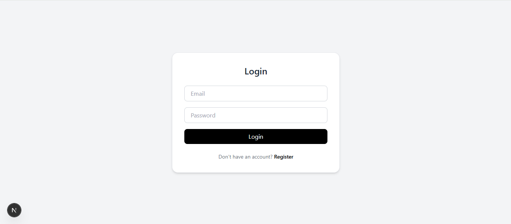
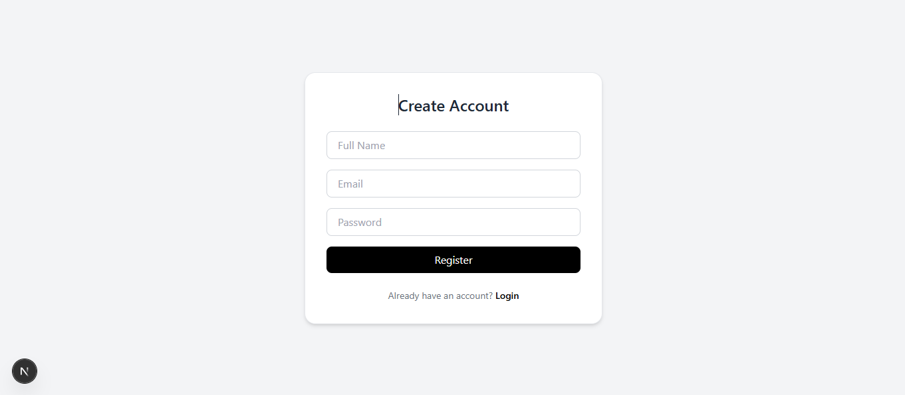
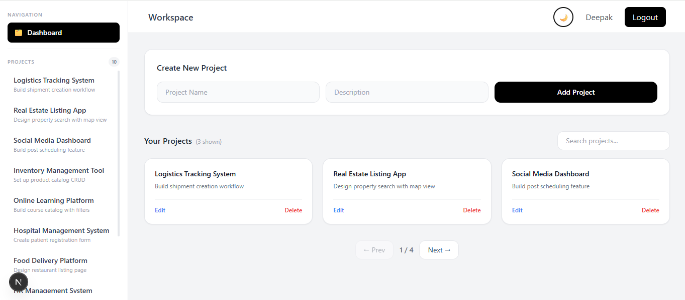
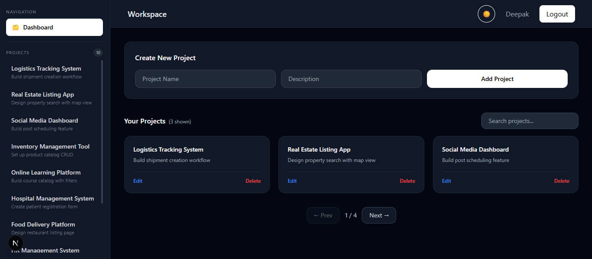
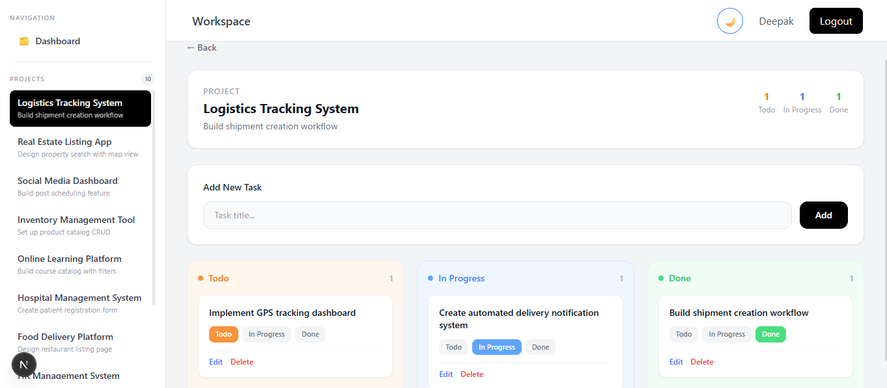
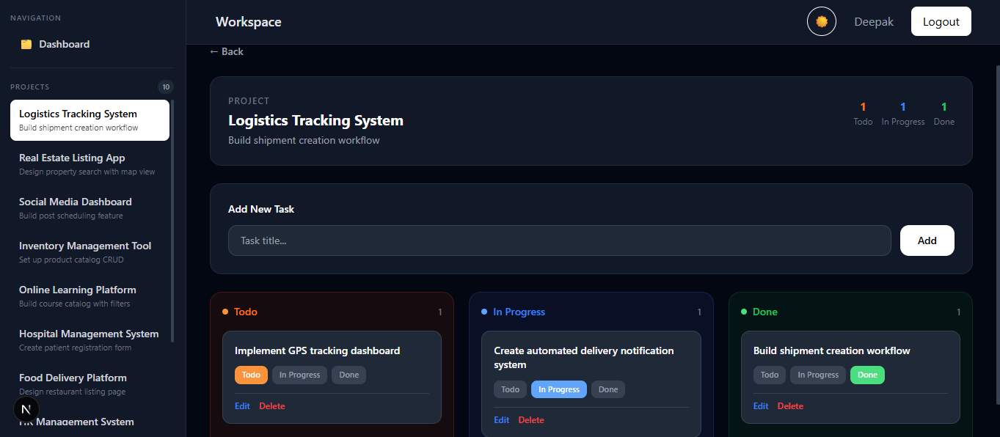

# 🚀 Next.js MERN Stack App

A full-stack web application built using **Next.js, Node.js, Express, and MongoDB** that enables users to perform secure and efficient project and task management through a modern, responsive interface.

---

## 🌐 Live Deployments

| Platform | Frontend | Backend |
|----------|----------|---------| 
| ☁️ **Azure App Service** | https://mern-frontend-deepak.azurewebsites.net | https://mern-backend-deepak.azurewebsites.net |
| ☁️ **GCP Cloud Run** | https://mern-frontend-482064592313.asia-south1.run.app | https://mern-backend-482064592313.asia-south1.run.app |
| ▲ **Vercel** | https://nextjs-mern-stack-project.vercel.app | https://nextjs-mern-stack-project.onrender.com |

---

## 📸 Screenshots

### 🔐 Login Page


### 📝 Register Page


### 📋 Dashboard — Light Mode


### 🌙 Dashboard — Dark Mode


### ✅ Task Board — Light Mode


### 🌙 Task Board — Dark Mode


---

## ✨ Features

- 🔐 Secure JWT authentication (register + login)
- 📋 Full Project CRUD (Create, Read, Update, Delete)
- ✅ Kanban Task Board — Todo / In Progress / Done
- 🔍 Real-time search with debounce
- 📄 Paginated project list
- 🌙 Dark / Light mode toggle
- 🎨 Responsive UI with Tailwind CSS
- 📊 Per-project task count summary (Todo / In Progress / Done)
- 🔄 Sidebar auto-updates on project create/delete
- ☁️ Deployed on Azure App Service + GCP Cloud Run + Vercel

---

## 🛠 Tech Stack

| Layer | Technology |
|-------|-----------|
| Frontend | Next.js 16, React 19, Tailwind CSS |
| Backend | Node.js, Express.js, TypeScript |
| Database | MongoDB Atlas (Mongoose ODM) |
| Auth | JWT (JSON Web Tokens) |
| State | React Context API |
| Deployment | Azure App Service + GCP Cloud Run + Vercel |
| CI/CD | GCP Cloud Build + Artifact Registry |
| Containers | Docker, Docker Hub |

---

## ☁️ Azure App Service Architecture

```
Developer pushes to GitHub
         ↓
  Docker image built locally
         ↓
  Image pushed to Docker Hub
         ↓
┌─────────────────────────────────────┐
│        Azure App Service            │
│                                     │
│  mern-frontend-deepak  |  mern-backend-deepak  │
│  (Next.js Docker)      |  (Node.js Zip Deploy) │
│  South India           |  South India           │
└─────────────────────────────────────┘
         ↓
   MongoDB Atlas (Cloud DB)
   Env vars via App Service Settings
```

**Azure Services Used:**
- **App Service** — container and Node.js hosting (B1 Linux plan)
- **App Service Plan** — `mern-plan` (B1, South India region)
- **Docker Hub** — stores frontend Docker image
- **Kudu/OneDeploy** — zip deploy for backend

---

## ☁️ GCP Cloud Run Architecture

```
Developer pushes to GitHub
         ↓
  GCP Cloud Build triggers
         ↓
  Docker images built &
  pushed to Artifact Registry
         ↓
┌─────────────────────────────────────┐
│           GCP Cloud Run             │
│                                     │
│  mern-frontend   |   mern-backend   │
│  (Next.js)       |   (Node.js)      │
│  asia-south1     |   asia-south1    │
└─────────────────────────────────────┘
         ↓
   MongoDB Atlas (Cloud DB)
   Secrets via GCP Secret Manager
```

**GCP Services Used:**
- **Cloud Run** — serverless container hosting (auto-scales to zero)
- **Cloud Build** — CI/CD pipeline, builds Docker images on push
- **Artifact Registry** — stores Docker images
- **Secret Manager** — securely stores `MONGO_URI` and `JWT_SECRET`

---

## 🏗️ Application Architecture

```
┌─────────────────────────────────┐
│        Next.js Frontend         │
│  React 19 + Tailwind CSS        │
│  Azure App Service / GCP / Vercel│
└─────────────┬───────────────────┘
              │ REST API (JWT)
              ▼
┌─────────────────────────────────┐
│   Node.js + Express API         │
│   TypeScript + JWT Middleware   │
│   Azure App Service / GCP Run   │
└─────────────┬───────────────────┘
              │ Mongoose ODM
              ▼
┌─────────────────────────────────┐
│         MongoDB Atlas           │
│      (Cloud Database)           │
└─────────────────────────────────┘
```

---

## 📱 App Pages

| Page | Description |
|------|-------------|
| `/login` | JWT login with email + password |
| `/register` | New user registration |
| `/dashboard` | Project list with search + pagination |
| `/dashboard/[id]` | Kanban board for tasks per project |

---

## 🔐 Authentication Flow

```
User Login → POST /api/auth/login
      ↓
JWT Token Generated & Returned
      ↓
Token stored in localStorage
      ↓
Attached to all API requests via headers
      ↓
Express JWT Middleware validates token
      ↓
Protected routes accessible
```

---

## 🔗 API Overview

| Method | Endpoint | Description |
|--------|----------|-------------|
| POST | `/api/auth/register` | User registration |
| POST | `/api/auth/login` | Login, returns JWT |
| GET | `/api/projects` | List projects (paginated + search) |
| POST | `/api/projects` | Create project |
| GET | `/api/projects/:id` | Get single project by ID |
| PUT | `/api/projects/:id` | Update project |
| DELETE | `/api/projects/:id` | Delete project |
| GET | `/api/tasks/:projectId` | Get tasks for project |
| POST | `/api/tasks/:projectId` | Create task |
| PUT | `/api/tasks/task/:id` | Update task title/status |
| DELETE | `/api/tasks/task/:id` | Delete task |

---

## ⚙️ Getting Started Locally

```bash
git clone https://github.com/devReact001/nextjs-mern-stack-project.git
```

**Backend:**
```bash
cd server
npm install
# Create .env with MONGO_URI and JWT_SECRET
npm run dev
```

**Frontend:**
```bash
cd client
npm install
# Create .env.local with NEXT_PUBLIC_API_URL=http://localhost:5000
npm run dev
```

---

## 🚀 Deployment

### Azure App Service

```bash
# Backend — zip deploy
zip -r app.zip server/
az webapp deploy \
  --name mern-backend-deepak \
  --resource-group mern-stack-rg \
  --src-path app.zip \
  --type zip

# Frontend — Docker Hub
docker build \
  --build-arg NEXT_PUBLIC_API_URL=https://mern-backend-deepak.azurewebsites.net \
  -t wearedevteam/mern-frontend:latest ./client
docker push wearedevteam/mern-frontend:latest

az webapp config container set \
  --name mern-frontend-deepak \
  --resource-group mern-stack-rg \
  --container-image-name wearedevteam/mern-frontend:latest \
  --container-registry-url https://index.docker.io
```

### GCP Cloud Run

```bash
# Build and deploy backend
gcloud builds submit ./server \
  --tag asia-south1-docker.pkg.dev/PROJECT_ID/mern-stack/mern-backend:latest
gcloud run deploy mern-backend \
  --image=asia-south1-docker.pkg.dev/PROJECT_ID/mern-stack/mern-backend:latest \
  --region=asia-south1 \
  --set-secrets=MONGO_URI=MONGO_URI:latest,JWT_SECRET=JWT_SECRET:latest

# Build and deploy frontend
gcloud builds submit ./client \
  --tag asia-south1-docker.pkg.dev/PROJECT_ID/mern-stack/mern-frontend:latest
gcloud run deploy mern-frontend \
  --image=asia-south1-docker.pkg.dev/PROJECT_ID/mern-stack/mern-frontend:latest \
  --region=asia-south1
```

---

## 🔮 Future Improvements

- 🔄 Real-time updates using Socket.io
- 🔍 Advanced search and filtering
- 👥 Role-based authentication (RBAC)
- 🌙 Persistent dark mode (localStorage)
- 📁 File upload functionality
- 📊 Project analytics dashboard
- 🔔 Task deadline notifications
- 🏷️ Task labels and priority levels

---

## 📬 Contact

- 🐙 GitHub: [github.com/devReact001](https://github.com/devReact001)
- 💼 LinkedIn: [linkedin.com/in/deepak-prasad](https://linkedin.com/in/deepak-prasad)
- 🌐 Portfolio: [sql-nextjs.vercel.app](https://sql-nextjs.vercel.app)

---

<div align="center">

⭐ If you found this project useful, consider giving it a star!

**[Azure Live](https://mern-frontend-deepak.azurewebsites.net)** · **[GCP Live](https://mern-frontend-482064592313.asia-south1.run.app)** · **[Vercel Live](https://nextjs-mern-stack-project.vercel.app)** · **[GitHub](https://github.com/devReact001/nextjs-mern-stack-project)**

</div>
